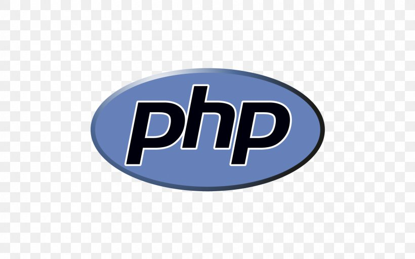

## Movie quotes
<p align="left">
    // about this site
</p>

## Table of Contents

* [Prerequisites](#prerequisites)
* [Getting started](#getting-started)
* [Migrations](#migration)
* [Admin registrations](#admin-registration)

## Prerequisites

*  *PHP@8.0 and up*
*  *npm@6 and up*
*  *composer@2.1.9*

## Getting started

1. first you needFirst of all you need to clone this repository from github:

```sh
git clone https://github.com/RedberryInternship/tazokenkebashvili-movie-quotes.git
```

2. Next step requires you to run *composer install* in order to install all the dependencies.

```sh
composer install
```

3. after you have installed all the PHP dependencies, it's time to install all the JS dependencies:

```sh
npm install
```

and also:
```sh
npm run dev
```

4. Now we need to set our env file. Go to the root of your project and execute this command.
```sh
cp .env.example .env
```
And now you should provide .env file all the necessary environment variables:

#
### Migration

```sh
php artisan migrate
```
#
### Admin registration

```sh
php artisan command:create-admin
```

// example

```shell
 username: :
 > exampleName        

 email: :
 > example@example.com

 password: :
 > exsamplePassword
 
 admin created
```
