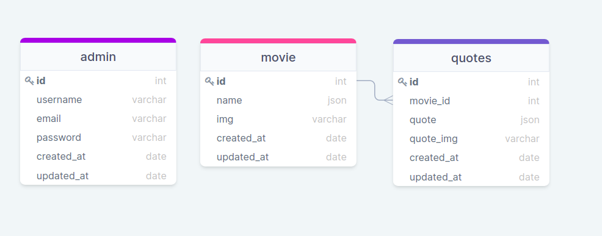

## Movie quotes
<p align="left">
    This site has two pages. On the first page randomly appears
    a movie and a quote from that film. We can move from the first 
    page to another, where will be a list of quotes from a specific
    movie. Also the site has an admin panel, where he / she can add, 
    delete or edit movies and quotes.
</p>

## Table of Contents

* [Prerequisites](#prerequisites)
* [Packages](#packages)
* [Getting started](#getting-started)
* [Database tables](#database-tables)
* [Migrations](#migration)
* [Admin registrations](#admin-registration)
* [Resources](#resources)

## Prerequisites

*  *PHP@8.0 and up*
*  *npm@6 and up*
*  *composer@2.1.9*

## Packages

* [*spatie/laravel-translatable ^4.4*](https://github.com/spatie/laravel-translatable)
* [*codezero-be / laravel-unique-translation*](https://github.com/codezero-be/laravel-unique-translation)


## Getting started

1. First of all you need to clone this repository from github:

```sh
git clone https://github.com/RedberryInternship/tazokenkebashvili-movie-quotes.git
```

2. Next step requires from you to run *composer install* in order to install all the dependencies.

```sh
composer install
```

3. after you have installed all the PHP dependencies, it's time to install all the JS dependencies:

```sh
npm install
```

and also:
```sh
npm run dev
```

4. Now we need to set our env file. Go to the root of your project and execute this command.
```sh
cp .env.example .env
```
And now you should provide .env file all the necessary environment variables:

#
### Database tables



#
### Migration

```sh
php artisan migrate
```

#
### Storage link

```sh
php artisan storage:link
```

#
### Admin registration

```sh
php artisan command:create-admin
```

// example

```shell
 username: :
 > exampleName        

 email: :
 > example@example.com

 password: :
 > exsamplePassword
 
 admin created
```

#
### Resources

* [Figma Designs](https://www.figma.com/file/IIJOKK5esgM8uK8pM3D59J/Movie-Quotes?node-id=0%3A1)
* [DrawSQL](https://drawsql.app/redberry-4/diagrams/copy-of-movie-quotes)
